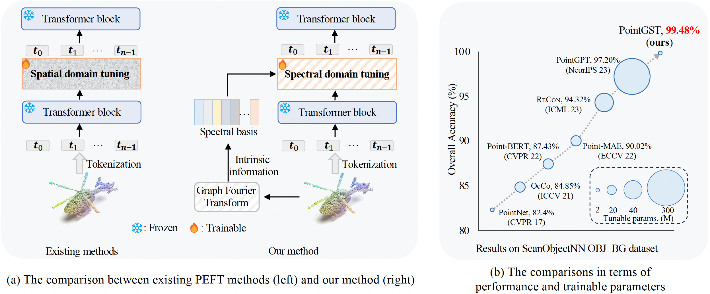
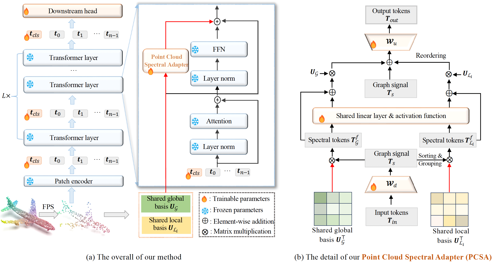
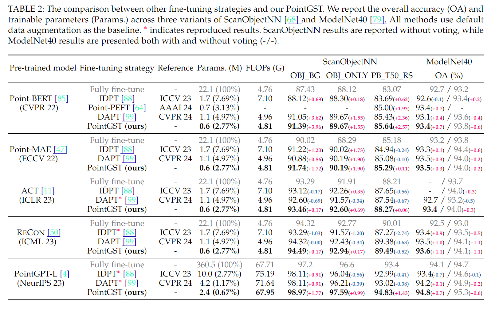
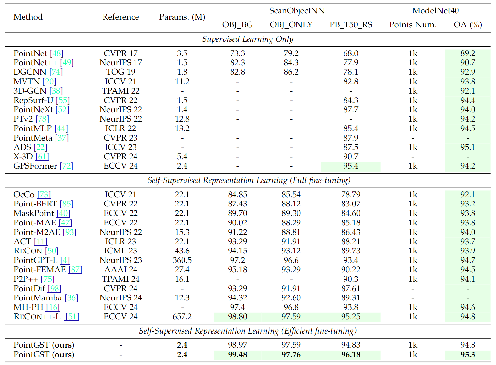

<div align="center">
<h1>Parameter-Efficient Fine-Tuning in Spectral Domain for Point Cloud Learning🚀</h1>


[Dingkang Liang](https://dk-liang.github.io/)<sup>1</sup>\* ,[Tianrui Feng](https://github.com/jerryfeng2003)<sup>1</sup>\* ,[Xin Zhou](https://lmd0311.github.io/)<sup>1</sup>\* , Yumeng Zhang<sup>2</sup>, [Zhikang Zou](https://bigteacher-777.github.io/)<sup>2</sup>, and [Xiang Bai](https://scholar.google.com/citations?user=UeltiQ4AAAAJ&hl=en)<sup> 1✉️</sup>

<sup>1</sup>  Huazhong University of Science and Technology, <sup>2</sup>  Baidu Inc.

(*) equal contribution, (​✉️​) corresponding author.

[](https://arxiv.org/abs/2410.08114)
[](https://github.com/tatsu-lab/stanford_alpaca/blob/main/LICENSE)
[](https://paperswithcode.com/sota/3d-point-cloud-classification-on-scanobjectnn?p=parameter-efficient-fine-tuning-in-spectral)
[](https://paperswithcode.com/sota/3d-parameter-efficient-fine-tuning-for?p=parameter-efficient-fine-tuning-in-spectral)
[](https://paperswithcode.com/sota/3d-parameter-efficient-fine-tuning-for-1?p=parameter-efficient-fine-tuning-in-spectral)
[](https://paperswithcode.com/sota/3d-point-cloud-classification-on-modelnet40?p=parameter-efficient-fine-tuning-in-spectral)

</div>

## News

**[2025-07-26]** [PointGST](https://arxiv.org/abs/2410.08114) is accepted by TPAMI. 🎉

**[2024-10-10]** [PointGST](https://arxiv.org/abs/2410.08114) is released. 🔥

## Abstract

Recently, leveraging pre-training techniques to enhance point cloud models has become a hot research topic. However, existing approaches typically require full fine-tuning of pre-trained models to achieve satisfied performance on downstream tasks, accompanying storage-intensive and computationally demanding. To address this issue, we propose a novel Parameter-Efficient Fine-Tuning (PEFT) method for point cloud, called **PointGST** (**Point** cloud **G**raph **S**pectral **T**uning). PointGST freezes the pre-trained model and introduces a lightweight, trainable Point Cloud Spectral Adapter (PCSA) to fine-tune parameters in the spectral domain.

<div  align="center">    
 
</div> 

Extensive experiments on challenging point cloud datasets across various tasks demonstrate that PointGST not only outperforms its fully fine-tuning counterpart but also significantly reduces trainable parameters, making it a promising solution for efficient point cloud learning. More importantly, it improves upon a solid baseline by +2.28\%, 1.16\%, and 2.78\%, resulting in 99.48\%, 97.76\%, and 96.18\% on the ScanObjNN OBJ\_BG, OBJ\_OBLY, and PB\_T50\_RS datasets, respectively. This advancement establishes a new state-of-the-art, using only 0.67\% of the trainable parameters.

## Overview
<div  align="center">    
 
</div>

## Getting Started

### Installation

We recommend using Anaconda for the installation process:
```bash
git clone https://github.com/jerryfeng2003/PointGST.git
cd PointGST/

```
### Requirements
```bash
conda create -y -n pgst python=3.9
conda activate pgst
pip install torch==2.0.0 torchvision==0.15.1 torchaudio==2.0.1 --index-url https://download.pytorch.org/whl/cu118
pip install -r requirements.txt

# Chamfer Distance & emd
cd ./extensions/chamfer_dist
python setup.py install --user
cd ../emd
python setup.py install --user

# PointNet++
pip install "git+https://github.com/erikwijmans/Pointnet2_PyTorch.git#egg=pointnet2_ops&subdirectory=pointnet2_ops_lib"

# GPU kNN
pip install --upgrade https://github.com/unlimblue/KNN_CUDA/releases/download/0.2/KNN_CUDA-0.2-py3-none-any.whl

```
### Datasets

See [DATASET.md](./DATASET.md) for details.

## Main Results

<div  align="center">    
 
</div>

<div  align="center">    
 
</div>

| Baseline | Trainable Parameters | Dataset | Config | Acc. | Download |
| :---- | :---- | :---- | :---- | :---- | :---- |
| Point-MAE <br> (ECCV 22) | 0.6M |ModelNet40 <br> OBJ_BG <br> OBJ_ONLY <br> PB_T50_RS | [modelnet](./cfgs/mae/finetune_modelnet_pgst.yaml) <br> [scan_objbg](./cfgs/mae/finetune_scan_objbg_pgst.yaml) <br> [scan_objonly](./cfgs/mae/finetune_scan_objonly_pgst.yaml) <br> [scan_hardest](./cfgs/mae/finetune_scan_hardest_pgst.yaml) | 93.5 <br> 91.74 <br> 90.19 <br> 85.29 | [ckpt](https://github.com/jerryfeng2003/PointGST/releases/download/ckpts/modelnet_mae.pth) <br> [ckpt](https://github.com/jerryfeng2003/PointGST/releases/download/ckpts/scan_objbg_mae.pth) <br> [ckpt](https://github.com/jerryfeng2003/PointGST/releases/download/ckpts/scan_objonly_mae.pth) <br> [ckpt](https://github.com/jerryfeng2003/PointGST/releases/download/ckpts/scan_hardest_mae.pth) |
| ACT <br> (ICLR 23)| 0.6M |ModelNet40 <br> OBJ_BG <br> OBJ_ONLY <br> PB_T50_RS | [modelnet](./cfgs/act/finetune_modelnet_pgst.yaml) <br> [scan_objbg](./cfgs/act/finetune_scan_objbg_pgst.yaml) <br> [scan_objonly](./cfgs/act/finetune_scan_objonly_pgst.yaml) <br> [scan_hardest](./cfgs/act/finetune_scan_hardest_pgst.yaml) | 93.4 <br> 93.46 <br> 92.60 <br> 88.27  | [ckpt](https://github.com/jerryfeng2003/PointGST/releases/download/ckpts/modelnet_act.pth) <br> [ckpt](https://github.com/jerryfeng2003/PointGST/releases/download/ckpts/scan_objbg_act.pth) <br> [ckpt](https://github.com/jerryfeng2003/PointGST/releases/download/ckpts/scan_objonly_act.pth) <br> [ckpt](https://github.com/jerryfeng2003/PointGST/releases/download/ckpts/scan_hardest_act.pth) |
| ReCon <br> (ICML 23) | 0.6M |ModelNet40 <br> OBJ_BG <br> OBJ_ONLY <br> PB_T50_RS | [modelnet](./cfgs/recon/finetune_modelnet_pgst.yaml) <br> [scan_objbg](./cfgs/recon/finetune_scan_objbg_pgst.yaml) <br> [scan_objonly](./cfgs/recon/finetune_scan_objonly_pgst.yaml) <br> [scan_hardest](./cfgs/recon/finetune_scan_hardest_pgst.yaml) | 93.6 <br> 94.49 <br> 92.94 <br> 89.49 | [ckpt](https://github.com/jerryfeng2003/PointGST/releases/download/ckpts/modelnet_recon.pth) <br> [ckpt](https://github.com/jerryfeng2003/PointGST/releases/download/ckpts/scan_objbg_recon.pth) <br> [ckpt](https://github.com/jerryfeng2003/PointGST/releases/download/ckpts/scan_objonly_recon.pth) <br> [ckpt](https://github.com/jerryfeng2003/PointGST/releases/download/ckpts/scan_hardest_recon.pth) |
| PointGPT-L <br> (NeurIPS 24)| 2.4M |ModelNet40 <br> OBJ_BG <br> OBJ_ONLY <br> PB_T50_RS | [modelnet](./cfgs/pointgpt/finetune_modelnet_pgst.yaml) <br> [scan_objbg](./cfgs/pointgpt/finetune_scan_objbg_pgst.yaml) <br> [scan_objonly](./cfgs/pointgpt/finetune_scan_objonly_pgst.yaml) <br> [scan_hardest](./cfgs/pointgpt/finetune_scan_hardest_pgst.yaml) | 94.8 <br> 98.97 <br> 97.59 <br> 94.83| [ckpt](https://github.com/jerryfeng2003/PointGST/releases/download/ckpts/modelnet_gpt.pth) <br> [ckpt](https://github.com/jerryfeng2003/PointGST/releases/download/ckpts/scan_objbg_gpt.pth) <br> [ckpt](https://github.com/jerryfeng2003/PointGST/releases/download/ckpts/scan_objonly_gpt.pth) <br> [ckpt](https://github.com/jerryfeng2003/PointGST/releases/download/ckpts/scan_hardest_gpt.pth) |
| PointGPT-L (voting) <br> (NeurIPS 24) | 2.4M |ModelNet40 <br> OBJ_BG <br> OBJ_ONLY <br> PB_T50_RS | [modelnet](./cfgs/pointgpt/finetune_modelnet_pgst.yaml) <br> [scan_objbg](./cfgs/pointgpt/finetune_scan_objbg_pgst.yaml) <br> [scan_objonly](./cfgs/pointgpt/finetune_scan_objonly_pgst.yaml) <br> [scan_hardest](./cfgs/pointgpt/finetune_scan_hardest_pgst.yaml) | 95.3 <br> 99.48 <br> 97.76 <br> 96.18| [log](https://github.com/jerryfeng2003/PointGST/releases/download/ckpts/modelnet_gpt_vote.log) <br> [log](https://github.com/jerryfeng2003/PointGST/releases/download/ckpts/scan_objbg_gpt_vote.log) <br> [log](https://github.com/jerryfeng2003/PointGST/releases/download/ckpts/scan_objonly_gpt_vote.log) <br> [log](https://github.com/jerryfeng2003/PointGST/releases/download/ckpts/scan_hardest_gpt_vote.log) |

The evaluation commands with checkpoints should be in the following format:
```shell
CUDA_VISIBLE_DEVICES=<GPU> python main.py --test --config <path/to/cfg> --exp_name <path/to/output> --ckpts <path/to/ckpt>

# further enable voting mechanism
CUDA_VISIBLE_DEVICES=<GPU> python main.py --test --vote --config <path/to/cfg> --exp_name <path/to/output> --ckpts <path/to/ckpt>
```

All the experiments are conducted on a single NVIDIA 3090 GPU.
### t-SNE visualization

```shell
# t-SNE on ScanObjectNN
CUDA_VISIBLE_DEVICES=<GPU> python main.py --config <path/to/cfg> --ckpts <path/to/ckpt> --tsne --exp_name <path/to/output>
```
## To Do

- [x] Release the inference code for classification.
- [x] Release the checkpoints for classification.
- [ ] Release the training code for classification.
- [ ] Release the code for segmentation.

## Acknowledgement

This project is based on Point-BERT ([paper](https://arxiv.org/abs/2111.14819), [code](https://github.com/lulutang0608/Point-BERT)), Point-MAE ([paper](https://arxiv.org/abs/2203.06604), [code](https://github.com/Pang-Yatian/Point-MAE)), ACT([paper](https://arxiv.org/abs/2212.08320), [code](https://github.com/RunpeiDong/ACT)), ReCon ([paper](https://arxiv.org/abs/2302.02318), [code](https://github.com/qizekun/ReCon)), PointGPT([paper](https://arxiv.org/abs/2305.11487), [code](https://github.com/CGuangyan-BIT/PointGPT)), IDPT ([paper](https://arxiv.org/abs/2304.07221), [code](https://github.com/zyh16143998882/ICCV23-IDPT)), and DAPT([paper](https://arxiv.org/abs/2403.01439), [code](https://github.com/LMD0311/DAPT)). Thanks for their wonderful works.

 ## Citation

If you find this repository useful in your research, please consider giving a star ⭐ and a citation.
```bibtex
@article{liang2024pointgst,
  title={Parameter-Efficient Fine-Tuning in Spectral Domain for Point Cloud Learning},
  author={Liang, Dingkang and Feng, Tianrui and Zhou, Xin and Zhang, Yumeng and Zou, Zhikang and Bai, Xiang},
  journal={IEEE transactions on pattern analysis and machine intelligence},
  year={2025},
  publisher={IEEE}
}
```
